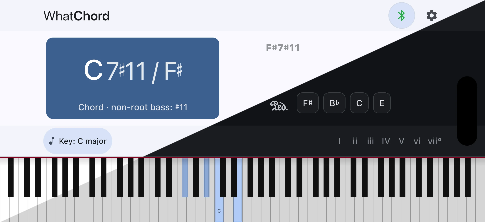

<p align="center">
  
</p>

<h1 align="center">WhatChord</h1>

<p align="center">
  <a href="https://apps.apple.com/us/app/whatchord-midi/id6758409779">
    </a>
  <a
    href="https://play.google.com/store/apps/details?id=com.earthmanmuons.whatchord"
  >
    </a>
</p>

WhatChord identifies chords from live Bluetooth or USB MIDI input and includes
Explore modes for building chords and scales without a connected keyboard. It is
optimized for speed, accuracy, and musician-expected naming, favoring stable,
conventional interpretations over simple note-matching.

**Website:** <https://whatchord.earthmanmuons.com>

---

## Features

- **Real-time MIDI analysis**  
  Connect a Bluetooth or USB MIDI keyboard and see chords update instantly as
  you play.

- **Explore chords**  
  Tap the chord card to open explore mode and try chord roots, qualities,
  extensions, and bass notes without a MIDI device.

- **Explore scales** Tap the scale-degree strip to browse scale tones, keyboard
  patterns, and diatonic chords across a wide range of scales.

- **Musically informed chord detection**  
  Goes beyond simple note-matching by ranking and resolving ambiguous
  interpretations using musical context such as inversions, extensions, upper
  structures, and diatonic preference.

- **Ambiguity-aware user interface**  
  When multiple interpretations are plausible, WhatChord shows alternative
  candidates rather than hiding uncertainty, and lets you tap them to see why
  the current chord ranked first.

- **Context-aware spelling**  
  Notes and chord symbols are spelled using the current key signature _and_ the
  identified chord context, producing appropriate enharmonic spellings.

- **Notation style preferences**  
  Choose between text-based and traditional symbolic chord notation conventions
  so chord names read naturally to you.

## Screenshots

Here's WhatChord in action:

<p>
  
</p>

## Installation

WhatChord is available to install in several ways. Choose the option that best
fits your platform and update preferences.

### iOS (App Store)

WhatChord is available on the App Store for iPhone and iPad.

<p>
  <a href="https://apps.apple.com/us/app/whatchord-midi/id6758409779">
    
  </a>
</p>

### Android (Google Play)

WhatChord is available on the Google Play Store for supported Android devices.

<p>
  <a href="https://play.google.com/store/apps/details?id=com.earthmanmuons.whatchord">
    
  </a>
</p>

> Google Play availability may vary by region during staged rollouts.

### Android (GitHub APK)

For advanced users who prefer direct distribution or third-party updater
workflows, WhatChord also publishes **signed Android APKs** with every GitHub
Release.

#### Recommended: Obtanium

[Obtanium](https://obtainium.imranr.dev/) allows you to securely track and
install APK releases directly from GitHub while verifying developer signatures.

**Workflow:**

1. Install Obtanium on your Android device.
2. Add the WhatChord [GitHub repository][REPO] as an _App source URL_.
3. Obtanium will automatically detect new releases and prompt you to update.
4. Verify the APK signature against the published developer key (see below).

[REPO]: https://github.com/EarthmanMuons/whatchord

### Developer Signing Key (Android)

All official Android builds distributed via Google Play and GitHub are signed
with the same developer key. You are encouraged to verify the signing
certificate fingerprint for this key using [AppVerifier] or Android's native
package verification tooling.

**Signing Certificate Fingerprint (SHA-256)**

```
com.earthmanmuons.whatchord
E8:21:56:94:BA:A2:E0:A3:48:E6:97:49:3E:8B:A9:92:94:93:5E:46:DD:17:03:2C:3C:67:F3:63:9F:A1:3E:F8
```

> ⚠️ Do not install builds whose signing key does not match the fingerprint
> published here.

[AppVerifier]: https://github.com/soupslurpr/AppVerifier

## Who Is This For?

WhatChord is particularly useful for:

- Pianists and keyboardists exploring harmony at the instrument
- Students learning scales, scale degrees, chord construction, extensions,
  inversions, and voicings
- Educators demonstrating harmonic concepts, scale harmony, and chord function
  in real time
- Composers and improvisers checking or exploring complex harmony

It provides immediate, intelligent feedback while you play. It is **not**
intended to replace formal analysis tools or notation software, but to
complement your practice and exploration.

## Status

WhatChord is under active development. The app is free to use, contains no
advertisements, and does not collect or transmit any personal data. Scoring
heuristics and user interface details may evolve as edge cases and real-world
usage inform improvements.

If you believe a chord has been identified incorrectly, please [open an
issue][ISSUE] on the GitHub repository. When possible, include the notes you
played, the key signature, and the chord WhatChord reported versus the expected
result. Sharing this data helps debug edge cases and improve the engine.

You can long-press the chord card to open Analysis Details and collect
diagnostic information for a report.

[ISSUE]: https://github.com/EarthmanMuons/whatchord/issues/new/choose

---

Apple, the Apple logo, and App Store are trademarks of Apple Inc., registered in
the U.S. and other countries and regions.

Google Play and the Google Play logo are trademarks of Google LLC.

## License

WhatChord is released under the [Zero Clause BSD License](LICENSE) (SPDX: 0BSD).

Copyright &copy; 2025&ndash;2026 [Aaron Bull Schaefer][EMAIL] and contributors

[EMAIL]: mailto:aaron@elasticdog.com
